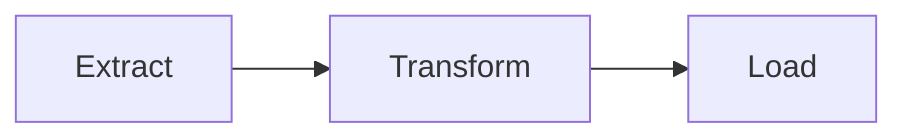

# 🤖 Inteligencia Artificial Aplicada

| Docente | Web |
| ------------- | ------------- |
|🧑‍🏫 [Ing. Cesar Uribe](https://www.linkedin.com/in/uribealvites/)  | [https://lab.zildar.com](https://lab.zildar.com)  |

---

# Segunda Sesión

## ANALÍTICA AUMENTADA Y GENERACIÓN DE REPORTES

**Temas:**
* Fundamentos del Análisis de Datos​
* Introducción a la Inteligencia de negocios​
* Decisiones basadas en datos con IA

---

# 🧠⚡ ChatGPT + Mermaid
### De texto a diagramas profesionales en **3 minutos**

---

## El Problema ⏱️
- **45-90 min** por diagrama tradicional
- **$20-100/año** en licencias
- Interfaces complejas y lentas
- Tiempo sin valor añadido

**75%** de empresas adoptaron IA en 2024

---

## La Solución ✅
### ChatGPT + Mermaid = Pipeline visual
1. ✍️ Describe en lenguaje natural
2. 🤖 ChatGPT genera código Mermaid
3. 🖼️ Render a PNG/SVG
4. 🔄 Edición instantánea

**Resultado:** **–85%** tiempo, **–70%** errores

---

## Framework OSAC ⚙️
1. **Objetivo** – Qué vas a diagramar
2. **Salida** – Formato exacto (Mermaid + tipo)
3. **Advertencia** – Restricciones o límites
4. **Contexto** – Escenario de uso

---

## Prompts Esenciales 🚀

**Diagrama de Flujo:**
```
OBJETIVO: Crear flujo para [PROCESO]
SALIDA: flowchart TD con máx. 8 pasos
CONTEXTO: Presentación ejecutiva
```

**Organigrama:**
```
OBJETIVO: Estructura del equipo
SALIDA: flowchart TB con jerarquías
CONTEXTO: Documento organizacional
```

---

## 🛠️ Ejercicio en Clase (15 min)
1. Identifica proceso que haces ≥3 veces/semana
2. Aplica prompt adaptado a tu caso
3. Renderiza en mermaid.live → PNG
4. Comparte resultado y feedback

**Objetivo:** Diagrama funcional que uses realmente

---

# 📊 BI & Análisis de Datos
## De Excel a Inteligencia Empresarial

---

## ¿Qué es Business Intelligence? 📄
> Procesos y herramientas que convierten datos en decisiones empresariales

**Componentes clave:**
- Recolección → Transformación → Visualización → Decisión

---

## Proceso ETL ⚙️

- **Extract:** APIs, bases de datos, archivos
- **Transform:** limpieza, formato, reglas
- **Load:** Data Warehouse para análisis

---

## Dashboard Efectivo 🖥️
| Elemento | Propósito |
|----------|-----------|
| KPI principal | Medir desempeño clave |
| Filtros | Explorar dimensiones |
| Visuales | Apoyo interpretación |
| Narrativa | Guía para decisión |

---

# 🤖 IA como Analista 24/7
## Excel → Conversación Natural

---

## El Cambio de Paradigma ⚡
**Antes:** 4-8 horas en Excel + fórmulas + gráficos
**Ahora:** 5-15 min de conversación → Análisis completo

**Beneficios cuantificables:**
- **95%** menos tiempo
- **80%** menos errores
- **$0** vs $2,500/mes analista

---

## Caso Real: Controller Bajo Presión 📖
**Viernes 4:00 PM:** Análisis gastos ejecutivos para junta lunes

**Método IA (14 min total):**
1. Exportar CSV (3 min)
2. Subir a ChatGPT (1 min)
3. Solicitar análisis (2 min)
4. Generar PDF (3 min)
5. Consultas seguimiento (5 min)

---

## Prompts Clave 🎯

**Análisis Exploratorio:**
```
Eres analista senior. Analiza CSV de [DATASET].
1. Resumen estadístico variables clave
2. Patrones y tendencias principales
3. Anomalías o valores atípicos
4. 3 insights accionables
FORMATO: Ejecutivo con números específicos
```

---

**Visualización Automática:**
```
Crea 4 gráficos profesionales:
1. Tendencia temporal principal
2. Comparativa por categorías
3. Distribución de valores
4. Dashboard ejecutivo
FORMATO: Código ejecutable + explicaciones
```

---

## 🏃‍♂️ Ejercicio en Clase (15 min)
**Dataset:** Gastos personales (50 transacciones, 6 meses)
**Columnas:** Fecha, Categoría, Monto, Descripción

**Pasos:**
1. Crear CSV en Sheets (5 min)
2. Análisis con ChatGPT (5 min)
3. Generar gráficos (3 min)
4. Compartir insight sorprendente (2 min)

---

# 🌐 Dashboards HTML Profesionales
## De Datos a Web en 15 Minutos

---

## Por Qué HTML? 🚀
**Vs. Herramientas Tradicionales:**
- **Power BI:** 4-8h, licencias $$$, limitado
- **HTML + IA:** 15 min, $0, ilimitado

**Ventajas únicas:**
- 100% personalizable
- Responsive perfecto
- Sin dependencias de software

---

## Componentes Dashboard Profesional 🏗️
1. **Panel KPIs** → Métricas clave
2. **Gráfico Tendencias** → Evolución temporal
3. **Gráfico Barras** → Comparativas
4. **Tabla Dinámica** → Datos detallados
5. **Filtros Interactivos** → Drill-down
6. **Exportación** → PDF/PNG nativo

---

## Prompts Optimizados 🎯

**Dashboard Base:**
```
Crea dashboard HTML profesional con datos:
[PEGAR CSV]

COMPONENTES: 6 Graficos relevantes
TECNOLOGÍAS: HTML + Chart.js + Bootstrap
ESTILO: Ejecutivo moderno responsive
```

---

**Filtros Avanzados:**
```
Añade filtros profesionales:
- Selector rango fechas
- Dropdown categorías múltiple
- Búsqueda tiempo real
```

---

## Caso: María, Gerente Comercial 📖
**Desafío:** Presentar resultados trimestrales al board

**Proceso (25 min):**
1. CSV con registros (5 min)
2. Prompts → dashboard (10 min)
3. Visualizar resultado (2 min)
4. Subir Google Sites (8 min)

**Resultado:** Presentación exitosa vs. $150+ consultor

---

## 🏃‍♂️ Ejercicio en Clase (25 min)
**Dataset:** Ventas (30 registros)
**Cronograma:**
- Min 1-5: Preparar CSV
- Min 6-15: Dashboard base
- Min 16-20: Personalización
- Min 21-25: Google Sites + URL

**Entregable:** URL dashboard funcional

---

# 🧠 Decisiones Estratégicas con IA
## De Datos a Decisiones Ejecutivas

---

## El Desafío C-Suite ⚡
**Realidad actual:**
- **47 reportes/mes** promedio por directivo
- Solo **12%** contiene insights accionables
- **73%** decisiones con información incompleta

**Nueva realidad:** Datos → IA → Decisión en **45 minutos**

---

## Valor Estratégico Cuantificado 💰
| Métrica | Tradicional | IA Estratégico | Impacto |
|---------|-------------|----------------|---------|
| Tiempo análisis | 5-15 días | 45 min | 95% reducción |
| Precisión | 60-70% | 85-92% | +25% efectividad |
| Decisiones respaldadas | 40% | 95% | +137% confianza |

---

## Flujo de 3 Fases 🛠️

**FASE 1: Visor Dinámico (15 min)**
```
Crea visor HTML que:
- Procese 50K registros
- Auto-detecte KPIs por industria
- Genere insights preliminares
- Exporte PDF para análisis IA
```

---

**FASE 2: Reporte Ejecutivo (10 min)**
```
PÁGINA 1 - RESUMEN EJECUTIVO:
- 3 hallazgos críticos (1 línea c/u)
- 1 gráfico tendencia principal
- 2 métricas alerta (rojo/verde)
- Recomendación inmediata (1 párrafo)
```

---

**FASE 3: Análisis Estratégico (15 min)**
```
Eres consultor estratégico senior (20 años experiencia).
1. Analiza desde perspectiva estratégica
2. Identifica 3 insights NO EVIDENTES
3. Evalúa riesgos ocultos/oportunidades
4. Propón 2 decisiones específicas
5. Cuantifica impacto potencial
```

---

## Caso: CEO Expansión de Mercados 💼
**Decisión:** ¿Expandir territorios este trimestre?

**Resultado IA:** Mercado B tiene **340% más potencial**
**Decisión:** Concentrar recursos en mercado B
**Impacto:** $2.3M ahorro + 67% mayor ROI proyectado

---

## Validación Multi-Perspectiva 🎯

**Abogado del Diablo:**
```
Desafía las recomendaciones:
1. ¿Qué datos podrían invalidar conclusiones?
2. ¿Qué asume la IA incorrectamente?
3. ¿Qué escenarios falla no considerados?
4. ¿Correlaciones son causales?
5. ¿Qué haría competencia?
```

---

## 🏃‍♂️ Ejercicio Final (30 min)
**Caso:** Empresa retail - ¿3 tiendas nuevas o e-commerce?
**Dataset:** 5 años ventas (15,000 registros)

**Proceso:**
1. Visor dinámico (5 min)
2. Reporte PDF (5 min)
3. Análisis consultor (10 min)
4. Validación crítica (5 min)
5. Decisión documentada (5 min)

---

## El Costo de No Actuar 💸
**Impacto cuantificado:**
- Competidores deciden **20x más rápido**
- **$500K-$2M** anuales perdidos
- **25%** menos efectividad sin IA
- **18 meses** para obsolescencia total

---

## Tu Ventaja Inmediata 🚀
**En 45 minutos tendrás:**
- ✅ Decisión estratégica validada
- 📊 Insights que consultores cobran $150+
- 🎯 Proceso replicable
- 🏆 Ventaja competitiva sostenible

**Inversión:** $0-20/mes
**ROI:** Inmediato desde primera consulta

---

## 📅 Tu Plan de Acción
**Próximos 7 días:**
1. Identifica decisión crítica pendiente
2. Reúne datos relacionados (Excel/CSV)
3. Implementa flujo completo (45 min)
4. Compara vs. método tradicional

**Esta semana:** Reemplaza 1 análisis manual con IA
**Este mes:** Enseña metodología a equipo

---

## La Pregunta Final 🤔
> ¿Seguirás perdiendo 10+ horas semanales en análisis manual mientras tu competencia usa IA para decisiones instantáneas?

**La ventaja competitiva no espera.**
**Este es tu momento de liderazgo tecnológico.**

---

# Fin de la Segunda Sesión
## Preguntas & comentarios 🙌

---

# 🤖 Inteligencia Artificial Aplicada
## [Ing. Cesar Uribe](https://lab.zildar.com/)

>[https://lab.zildar.com](https://lab.zildar.com)