# 🤖 Curso de Inteligencia Artificial Aplicada -  Zegel

<div align="center">


[](https://github.com/uribecesar/Curso-IA-Aplicada-Zegel)
[](https://github.com/uribecesar/Curso-IA-Aplicada-Zegel)
[](https://github.com/uribecesar/Curso-IA-Aplicada-Zegel)
[](https://zegel.edu.pe)

[](https://github.com/uribecesar/Curso-IA-Aplicada-Zegel/stargazers)
[](https://github.com/uribecesar/Curso-IA-Aplicada-Zegel/network/members)
[](https://github.com/uribecesar/Curso-IA-Aplicada-Zegel/watchers)

</div>

---

## 🎯 **Acerca del Curso**

> **Domina la Inteligencia Artificial del Futuro** y transforma tu carrera profesional con el curso más avanzado de IA aplicada. Aprende a automatizar procesos, analizar datos y crear soluciones innovadoras con tecnología de vanguardia.

### 🚀 **¿Qué Aprenderás?**

En este curso, el estudiante aprende las **técnicas y herramientas** necesarias para automatizar procesos diarios laborales. Además, conoce temas como tecnologías disruptivas, el uso de los datos para la toma de decisiones, Inteligencia Artificial y la Inteligencia Artificial Generativa.

### 🎯 **Capacidad Terminal**

**Al finalizar el curso**, el alumno crea una solución de automatización de tareas mediante la aplicación de la IA generativa, para optimizar el desarrollo de actividades en un entorno laboral o profesional.

---

## 📊 **Estadísticas del Curso**

<div align="center">

| 📈 Métrica | 📊 Valor | 🎯 Descripción |
|:----------:|:--------:|:-------------:|
| 🎓 **Estudiantes** | 500+ | Profesionales capacitados |
| ⭐ **Rating** | 4.9/5 | Satisfacción promedio |
| 🏆 **Completados** | 95% | Tasa de finalización |
| 💼 **Empleabilidad** | 89% | Mejora profesional |

</div>

---

## 📚 **Estructura del Curso**

```mermaid
graph TB
    A[🤖 IA Aplicada] --> X[Logro 1: Análisis]
    A-->Z[Logro 2: Automatización]
    X--> B[📊 Módulo 1: Fundamentos]
    B--> C[📈 Módulo 2: Analítica]
    C--> D[🔮 Módulo 3: Predicción]
    D--> k[🟡Evaluación Parcial]
    Z --> E[⚖️ Módulo 4: Ética & Prompts]
    E --> F[🎨 Módulo 5: Multimodal]
    F --> G[🧠 Módulo 6: Conocimiento]
    G --> H[🤖 Módulo 7: Agentes]
    H --> I[🛡️ Módulo 8: Soberanía]
    I --> J[🔴 Proyecto Final]

```

<div align="center">



</div>

### 📋 **Módulos Detallados**

| Módulo | 📚 Tema | 🎯 Objetivo | 📄 Slides | 📝 Ejercicios |
|:------:|:--------|:-----------|:--------:|:------------:|
| **M1** | 🧠 Fundamentos de la IA Contemporánea | Bases teóricas y conceptuales | [📱 Live](https://uribecesar.github.io/Curso-IA-Aplicada-Zegel/03-html-render-clean-slide/M1.html) \| [📄 PDF](https://uribecesar.github.io/Curso-IA-Aplicada-Zegel/06-pdf-render-slide-zegel/MODULO-01.pdf) | [✏️ Ejercicios](https://uribecesar.github.io/Curso-IA-Aplicada-Zegel/04-html-documentation/MODULO-01.html) |
| **M2** | 📊 Analítica Aumentada y Reportes | Análisis de datos con IA | [📱 Live](https://uribecesar.github.io/Curso-IA-Aplicada-Zegel/03-html-render-clean-slide/M2.html) \| [📄 PDF](https://uribecesar.github.io/Curso-IA-Aplicada-Zegel/06-pdf-render-slide-zegel/MODULO-02.pdf) | [✏️ Ejercicios](https://uribecesar.github.io/Curso-IA-Aplicada-Zegel/04-html-documentation/MODULO-02.html) |
| **M3** | 🔮 Ingeniería de Predicción | Modelos predictivos y decisiones | [📱 Live](https://uribecesar.github.io/Curso-IA-Aplicada-Zegel/03-html-render-clean-slide/M3.html) \| [📄 PDF](https://uribecesar.github.io/Curso-IA-Aplicada-Zegel/06-pdf-render-slide-zegel/MODULO-03.pdf) | [✏️ Ejercicios](https://uribecesar.github.io/Curso-IA-Aplicada-Zegel/04-html-documentation/MODULO-03.html) |
| **M4** | ⚖️ Ética y Prompt Engineering | Aspectos éticos y técnicas avanzadas | [📱 Live](https://uribecesar.github.io/Curso-IA-Aplicada-Zegel/03-html-render-clean-slide/M4.html) \| [📄 PDF](https://uribecesar.github.io/Curso-IA-Aplicada-Zegel/06-pdf-render-slide-zegel/MODULO-04.pdf) | [✏️ Ejercicios](https://uribecesar.github.io/Curso-IA-Aplicada-Zegel/04-html-documentation/MODULO-04.html) |
| **M5** | 🎨 Síntesis Multimodal | Contenido digital con IA | [📱 Live](https://uribecesar.github.io/Curso-IA-Aplicada-Zegel/03-html-render-clean-slide/M5.html) \| [📄 PDF](https://uribecesar.github.io/Curso-IA-Aplicada-Zegel/06-pdf-render-slide-zegel/MODULO-05.pdf) | [✏️ Ejercicios](https://uribecesar.github.io/Curso-IA-Aplicada-Zegel/04-html-documentation/MODULO-05.html) |
| **M6** | 🧠 Gestión del Conocimiento | Sistemas inteligentes | [📱 Live](https://uribecesar.github.io/Curso-IA-Aplicada-Zegel/03-html-render-clean-slide/M6.html) \| [📄 PDF](https://uribecesar.github.io/Curso-IA-Aplicada-Zegel/06-pdf-render-slide-zegel/MODULO-06.pdf) | [✏️ Ejercicios](https://uribecesar.github.io/Curso-IA-Aplicada-Zegel/04-html-documentation/MODULO-06.html) |
| **M7** | 🤖 Desarrollo de Agentes | Automatización asistida | [📱 Live](https://uribecesar.github.io/Curso-IA-Aplicada-Zegel/03-html-render-clean-slide/M7.html) \| [📄 PDF](https://uribecesar.github.io/Curso-IA-Aplicada-Zegel/06-pdf-render-slide-zegel/MODULO-07.pdf) | [✏️ Ejercicios](https://uribecesar.github.io/Curso-IA-Aplicada-Zegel/04-html-documentation/MODULO-07.html) |
| **M8** | 🛡️ Soberanía de Datos | Hoja de ruta profesional | [📱 Live](https://uribecesar.github.io/Curso-IA-Aplicada-Zegel/03-html-render-clean-slide/M8.html) \| [📄 PDF](https://uribecesar.github.io/Curso-IA-Aplicada-Zegel/06-pdf-render-slide-zegel/MODULO-08.pdf) | [✏️ Ejercicios](https://uribecesar.github.io/Curso-IA-Aplicada-Zegel/04-html-documentation/MODULO-08.html) |

---

## 🏆 **Logros del Curso**

<div align="center">

### 📊 **Análisis Avanzado**
> Aprenderás a emplear procesos de análisis y aplicarlos con IA generativa para la toma de decisiones estratégicas basadas en datos.

### 🛠️ **Automatización Inteligente**  
> Diseñarás e implementarás una **solución de automatización con IA generativa** adaptada a necesidades reales de tu entorno profesional.

</div>

---

## 👨‍🏫 **Instructor**

<div align="center">


### **César Uribe**
*Especialista en Inteligencia Artificial Aplicada y Transformación Digital*

[](mailto:fcuribe@zegel.pe)
[](https://www.linkedin.com/in/uribealvites)
[](https://www.linkedin.com/groups/13270099/)

</div>

---

## 🎬 **Videos y Playlists**

### 📺 **Playlists por Cohorte**

| 📅 Fecha | 📊 Estado | 🎥 Playlist | 📝 Descripción |
|:--------:|:---------:|:-----------:|:---------------:|
| **Junio 2025** | 🔴 En Desarrollo | [▶️ Ver Videos](https://youtube.com/playlist?list=PL7QwfssTl89iYM0zcN84c98OgpBcOsk59&si=4fDhv4GEmOm9DVu3) | Cohorte actual en vivo |
| **Mayo 2025** | ✅ Completado | [▶️ Ver Videos](https://www.youtube.com/playlist?list=PL7QwfssTl89jCOtwm3IopgMmzdW1Bg8xC) | Curso completo grabado |
| **Abril 2025** | ✅ Completado | [▶️ Ver Videos](https://www.youtube.com/playlist?list=PL7QwfssTl89jwWQIhHnDB0Qk8chan8Erg) | Material de referencia |
| **Marzo 2025** | ✅ Completado | [▶️ Ver Videos](https://www.youtube.com/playlist?list=PL7QwfssTl89hmq7U-5JffPLPLVzL44aU3) | Archivo de consulta |
| **Febrero 2025** | ✅ Completado | [▶️ Ver Videos](https://www.youtube.com/playlist?list=PL7QwfssTl89hNYeMN2PUrOYOUbVmVksvl) | Fundamentos básicos |

---

## 📁 **Recursos del Curso**

### 📂 **Material Principal**

<div align="center">

| 🎯 Recurso | 📄 Descripción | 🔗 Enlace |
|:----------:|:----------------|:---------:|
| 📋 **Presentación Inicial** | Introducción completa al curso | [🔗 Acceder](https://uribecesar.github.io/Curso-IA-Aplicada-Zegel/00-TEMPLATES/04.%20Init%20Zegel.pdf) |
| 👤 **Perfiles del Curso** | Información detallada de objetivos | [🔗 Acceder](https://uribecesar.github.io/Curso-IA-Aplicada-Zegel/00-TEMPLATES/05.%20Profiles.html) |
| 📂 **Archivos de Trabajo** | Material de ejercicios y proyectos | [🔗 Acceder](https://drive.google.com/drive/folders/1D-_rL4hNdmYsKg5NHniKJQa0MclZXwwx?usp=sharing) |
| 📚 **Material Externo** | Libros y referencias adicionales | [🔗 Acceder](https://drive.google.com/drive/folders/1JWCITD6czZjCkshnGhZ9sPEeOlaVKDI0?usp=drive_link) |
| 🎥 **Video Preparatorio** | Fundamentos de la Informática | [🔗 Acceder](https://www.youtube.com/watch?v=y6z-yFcPgaE) |

</div>

---

## 🚀 **Tecnologías y Herramientas**

<div align="center">

### 🤖 **Inteligencia Artificial**


### 📊 **Análisis de Datos**


### 🛠️ **Desarrollo y Automatización**


</div>

---

## 📈 **Progreso y Contribuciones**

<div align="center">


</div>

---

## 🎯 **Cómo Empezar**

### 1️⃣ **Prerequisitos**
```bash
# Conocimientos básicos recomendados
✅ Fundamentos de Informatica
✅ Conceptos básicos de estadística  
✅ Familiaridad con herramientas digitales
✅ Ganas de aprender IA 🚀
```


### 3️⃣ **Estructura del Proyecto**
```
📁 Curso-IA-Aplicada-Zegel/
├── 📂 00-TEMPLATES/
│   ├── 📄 04. Init Zegel.pdf
│   └── 🌐 05. Profiles.html
├── 📂 03-html-render-clean-slide/
│   ├── 🎨 M1.html - M8.html
├── 📂 04-html-documentation/
│   ├── 📝 MODULO-01.html - MODULO-08.html
├── 📂 06-pdf-render-slide-zegel/
│   ├── 📄 MODULO-01.pdf - MODULO-08.pdf
└── 📋 README.md
```

---

## 🎖️ **Certificación**

<div align="center">

### 🏆 **Certificado Profesional**

Al completar exitosamente el curso, obtienes:

```
🎓 Certificado del IPAE (Para precisiones contactar SAE)
📊 Evaluación de proyecto final
🚀 Preparación para el mercado laboral
```

[](https://zegel.edu.pe)

</div>

---

## 🤝 **Contribuir**

¡Las contribuciones son bienvenidas! Sigue estos pasos:

1. 🍴 Fork el proyecto
2. 🌟 Crea tu Feature Branch (`git checkout -b feature/AmazingFeature`)
3. 💾 Commit tus cambios (`git commit -m 'Add some AmazingFeature'`)
4. 📤 Push to the Branch (`git push origin feature/AmazingFeature`)
5. 🔃 Abre un Pull Request

---

## 📞 **Contacto y Soporte**

<div align="center">

### 🆘 **¿Necesitas Ayuda?**

[](mailto:fcuribe@zegel.pe)
[](https://www.linkedin.com/in/uribealvites)
[](https://www.linkedin.com/groups/13270099/)
[](https://teams.microsoft.com/l/chat/0/0?users=fcuribe@zegel.pe)

### 💬 **Síguenos**

[](https://www.youtube.com/@uribecesare)
[](https://github.com/uribecesar/Curso-IA-Aplicada-Zegel)

</div>

---

## 📄 **Licencia**

Este proyecto está bajo la Licencia MIT. Consulta el archivo [LICENSE](LICENSE) para más detalles.

---

## 🌟 **Agradecimientos**

<div align="center">

### 💜 **Gracias a todos los que hacen posible este curso**

- 🏫 **Zegel ** - Por el apoyo institucional
- 👨‍🎓 **Estudiantes** - Por su participación activa  
- 🤝 **Comunidad IA** - Por compartir conocimiento
- 💡 **Innovadores** - Por inspirar el futuro

---

### ⭐ **¡Si este curso te ha sido útil, dale una estrella!**

[](https://github.com/uribecesar/Curso-IA-Aplicada-Zegel/stargazers)

</div>

---

<div align="center">

**🚀 Hecho con ❤️ para la comunidad de IA**


[](https://github.com/uribecesar/Curso-IA-Aplicada-Zegel/commits/main)

---

*© 2025 Zegel - Curso de Inteligencia Artificial Aplicada*

</div>