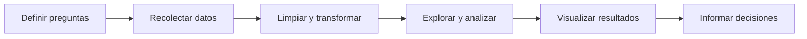
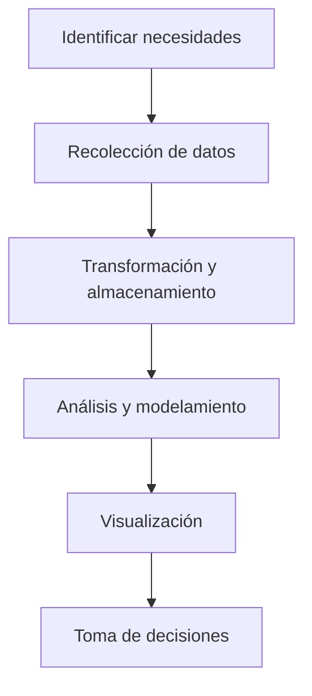
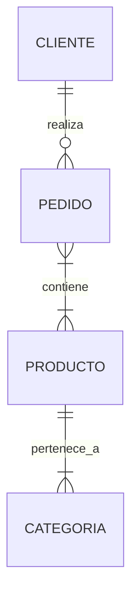
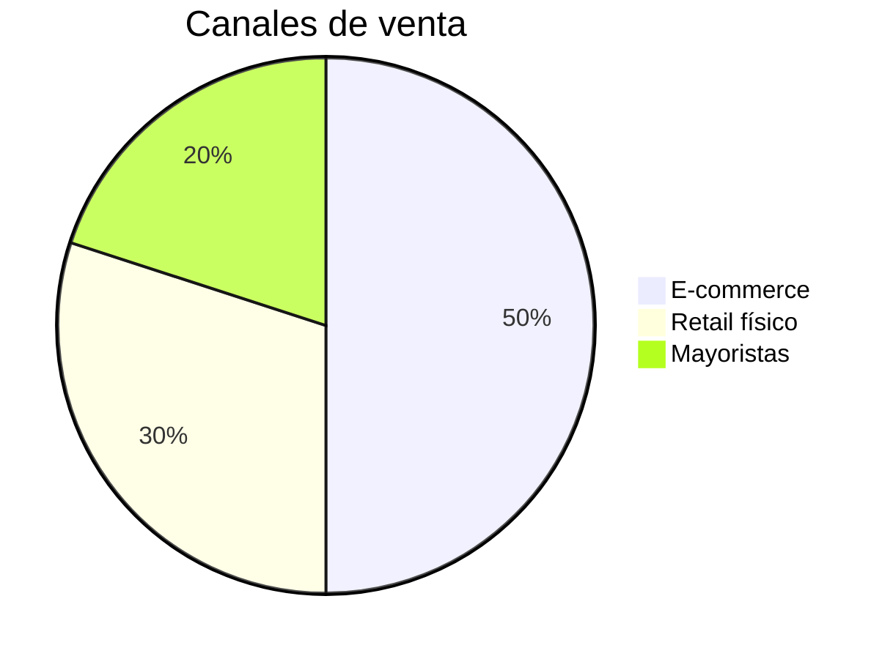
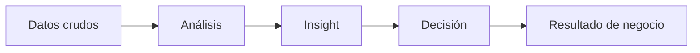

<!-- backgroundImage: url('../image/bg1.JPG') -->

<!-- _class: topic-main -->

# Inteligencia Artificial Aplicada

---

<!-- backgroundImage: url('../image/bg2.JPG') -->

<!-- _class: topic-main -->

# Segunda Sesión

---

<!-- backgroundImage: url('../image/bg2.JPG') -->

<!-- _class: subindicator-title -->

<h1 style="color: white"> Subindicador N°2: ANALÍTICA AUMENTADA Y GENERACIÓN DE REPORTES</h1>
Temas:

* Fundamentos del Análisis de Datos​
* Introducción  a la Inteligencia  de negocios​
* Bases de la toma de  decisiones con chatbots

---

<!-- backgroundImage: url('../image/bg3.JPG') -->

<!-- _class: topic-title -->

# Introducción al Prompt Visual


---
<!-- backgroundImage: url('../image/bg5.JPG') -->

<!-- _class: topic-title -->
# PARTE 1

---

# 🧠⚡ ChatGPT + Mermaid  
### De texto a diagramas profesionales en **3 minutos**  


---

## Situación ⏱️  
**¿Cuántas horas pierdes cada semana creando diagramas manualmente?**  
- 2 – 4 h/semana en PowerPoint, Visio o Whiteboard App  
- Interfaces complejas y lentas  
- Tiempo sin valor añadido

---

### Datos clave 📊  
- 85 % del tiempo de diagramación **no** aporta valor  
- Sólo 18 % de los equipos documenta procesos con IA

---

## Complicación 🔄  
Las herramientas gráficas tradicionales son un **cuello de botella**  
- ⏱️ 45 – 90 min por diagrama  
- 💸 200 – 500 USD/año en licencias  
- ❌ Conexiones y formatos frágiles

---

## Pregunta 🤔  
**¿Podemos convertir texto plano en diagramas listos para producción?**

---

## Respuesta ✅  
### ChatGPT + Mermaid = Pipeline visual  
1. ✍️ Describe tu idea en lenguaje natural  
2. 🤖 ChatGPT la traduce a **código Mermaid**  
3. 🖼️ Mermaid genera PNG/SVG/Markdown  
4. 🔄 Edición instantánea con texto

---

## Comparativa 🌟  
| | Método Tradicional | IA + Mermaid |
|---|---|---|
| Tiempo | ⏱️ 45‑90 min | ⚡ 2‑5 min |
| Habilidad | 🎨 Diseño requerido | 🤖 Descripción natural |
| Costo | 💸 Software $$$ | 🆓 Gratis |
| Iteración | 🔄 Difícil | ✏️ Instantánea |
| Colaboración | 👥 Limitada | 🔗 Código versionable |

---

## Beneficios Cuantificables 📈  
- ⏱️ **Tiempo**: –85 %  
- ❌ **Errores**: –70 % inconsistencias  
- 💸 **Costo**: s/0 vs s./200‑500/año  
- ⚡ **Velocidad**: 10× cambios  
- 🤝 **Colaboración**: 100 % compatible

---

## Caso de Uso 📅  
### El gerente pragmático  
- 9 : 00 AM → solicitud de diagrama  
- Método IA: **7 min**  
- Llegas 15 min antes a la reunión ✔️

---

### Pasos del flujo (7 min) 🛣️  
1. Abrir ChatGPT (2 min)  
2. Describir proceso (3 min)  
3. Copiar código Mermaid (30 s)  
4. Renderizar en mermaid.live (1 min)  
5. Exportar PNG/SVG (30 s)

---

## Framework ⚙️ **OSAC**  
1. **Objetivo** – Qué vas a diagramar  
2. **Salida** – Formato exacto (Mermaid + tipo)  
3. **Advertencia** – Restricciones o límites  
4. **Contexto** – Escenario de uso

---

## Prompts de Acción 🚀 (1/2)  

**Prompt 1 – Diagrama de Flujo**  
```text
OBJETIVO: Crear diagrama de flujo para [TU PROCESO]
SALIDA: flowchart TD con nodos de decisión claros
ADVERTENCIA: Máx. 8 pasos para claridad visual
CONTEXTO: Presentación ejecutiva de optimización
```

**Prompt 2 – Organigrama Dinámico**  
```text
OBJETIVO: Generar organigrama del equipo/departamento
SALIDA: flowchart TB con jerarquías definidas
ADVERTENCIA: Incluir sólo roles, no nombres
CONTEXTO: Documento de estructura organizacional
```

---

## Prompts de Acción 🚀 (2/2)  

**Prompt 3 – Línea de Tiempo**  
```text
OBJETIVO: Crear timeline con hitos clave
SALIDA: timeline con fechas y entregables
ADVERTENCIA: Máx. 10 hitos para evitar saturación
CONTEXTO: Seguimiento de proyecto para stakeholders
```

**Prompt 4 – Estado de Sistema**  
```text
OBJETIVO: Visualizar estados y transiciones de [TU SISTEMA]
SALIDA: stateDiagram-v2 con transiciones claras
ADVERTENCIA: Incluir estados de error y recuperación
CONTEXTO: Documentación técnica para desarrollo
```

---

## Ejercicio en Clase 🛠️ (15 min)  
1. Identifica un proceso que realizas ≥3 veces/sem  
2. Aplica **Prompt 1** adaptado a tu caso  
3. Renderiza en mermaid.live y exporta PNG  
4. Comparte con en clase → feedback

---

## Ejercicio de Tarea 🏠 (30 min)  
1. Crea organigrama con **Prompt 2**  
2. Añade flujo de comunicación entre roles  
3. Exporta ambos diagramas  
4. Presenta insights en 2 min

---

## Costo de No Actuar ⚠️  
- 3‑4 h perdidas/semana  
- **192 h/año** ≈ 5 semanas laborables  
- Oportunidad perdida: colegas con IA producen 10× más

---

## Recursos Mínimos 🧰  
- **ChatGPT Free** – Generar código  
- **mermaid.live** – Renderizar y exportar  
- Extras: Excalidraw · diagrams.net  
- Docs oficiales → <https://mermaid.js.org/>  
⏱️ Setup: 5 min · Costo: 0 USD

---

## Tu Siguiente Acción 🎯  
**Ahora**: abre ChatGPT + mermaid.live  
**10 min**: diseña flujo de decisiones de tu trabajo  
**Esta semana**: reemplaza 1 diagrama manual  
**Este mes**: enseña la técnica a un colega  


---

# Fin de la Primera Parte
## Preguntas & comentarios 🙌  

---

# SEGUNDA PARTE

---

# 🤖 IA Generativa: Tu Analista de Datos 24/7
## Sin Costos de Nómina 💰

---

# 📊 BI & Análisis de Datos

Transforma datos en decisiones empresariales con visión estratégica.

---

# 🌟 ¿Qué es el Análisis de Datos?

> Proceso sistemático para obtener información significativa a partir de datos crudos.

---

# 👤 ¿Qué hace un analista de datos?

- Recolecta datos relevantes
- Limpia y transforma información
- Aplica análisis estadístico
- Visualiza resultados
- Comunica hallazgos

---

# 🧰 Herramientas comunes

| Categoría    | Ejemplos                       |
|--------------|--------------------------------|
| Limpieza     | Excel, Python, Power Query     |
| Análisis     | R, SQL, Pandas                 |
| Visualización| Power BI, Tableau, Seaborn     |
| Automatización| Apps Script, ChatGPT          |

---

# 🧠 Proceso general de análisis



---

# 📊 Tipos de análisis

| Tipo          | Pregunta          |
|---------------|-------------------|
| Descriptivo   | ¿Qué pasó?        |
| Diagnóstico   | ¿Por qué pasó?    |
| Predictivo    | ¿Qué pasará?      |
| Prescriptivo  | ¿Qué hacer?       |

---

# 📄 ¿Qué es Business Intelligence?

> BI es el conjunto de procesos, tecnologías y herramientas que convierten los datos en información accionable para la empresa.

---

# 🧰 Componentes del BI

- Recolección de datos
- Almacenamiento
- Procesamiento
- Visualización
- Gobernanza

---

# ⬆️ Fases del Business Intelligence



---

# 🪧 ¿Qué es ETL?

> Proceso clave en BI: extraer, transformar y cargar datos.

---

# ⚙️ Proceso ETL


- **Extract**: de bases de datos, APIs, archivos
- **Transform**: limpieza, formatos, reglas
- **Load**: carga a Data Warehouse

---

# 🏠 Modelamiento de datos

> Diseño de estructuras que permiten consultas y análisis eficientes.



---

# 🧬 ¿Qué es un Data Warehouse?

- Repositorio central estructurado
- Permite análisis históricos y agregados
- Optimizado para lectura, no escritura

---

# 📊 Visualización: comunicar con datos

| Gráfico    | Utilidad                    |
|------------|-----------------------------|
| Líneas     | Tendencias temporales       |
| Barras     | Comparaciones               |
| Pie        | Proporciones                |
| Mapas      | Datos geográficos           |

---

# 📊 Ejemplo con Mermaid



---

# 🖥️ Dashboard de BI ideal

| Elemento     | Propósito                      |
|--------------|--------------------------------|
| KPI principal| Medir el desempeño clave       |
| Filtros      | Explorar distintas dimensiones |
| Visuales     | Apoyo a interpretación         |
| Narrativa    | Guía para la decisión          |

---

# 🧪 Caso: Dashboard de Ventas

- Total de ventas (KPI)
- Comparación mensual
- Ticket promedio por región
- Predicción trimestral de demanda

---

# 📊 Analítica descriptiva en acción

> Conoce el estado actual del negocio: ventas, visitas, conversiones, errores.

---

# 📈 Métricas comunes descriptivas

- Promedios
- Totales
- Frecuencias
- Tendencias
- Variaciones

---

# ⚖️ BI vs Análisis de Datos

| Aspecto       | BI                            | Análisis de Datos           |
|---------------|-------------------------------|-----------------------------|
| Enfoque       | Empresarial, decisional       | Exploratorio, técnico       |
| Usuario final | Gerencia, ejecutivos          | Analistas, científicos      |
| Herramientas  | Power BI, Tableau             | Python, R, SQL              |

---

# 🧠 Decisiones basadas en datos

> La inteligencia real no está en los datos, sino en las decisiones que tomamos con ellos.

---

# 🧩 Flujo de valor en BI



---

# 🧰 Herramientas recomendadas

| Área         | Ejemplos                      |
|--------------|-------------------------------|
| ETL          | dbt, Power Query, Talend       |
| Dashboarding | Power BI, Tableau              |
| Análisis     | Python, Excel, Notion          |
| Generación IA| ChatGPT, Gemini, Claude        |

---

# 🔄 La Revolución Silenciosa en Tu Escritorio

• **Realidad actual:** Miles de profesionales reemplazan horas de Excel con consultas de 30 segundos

---

• **No es magia:** Es Inteligencia de Negocios potenciada por IA generativa

---

• **El cambio:** De equipos especializados y software costoso → Conversación natural con resultados en minutos

---

# 📊 BI Tradicional: Las Tres Fases


---


## 🔄 ETL (Extraer, Transformar, Cargar)
Preparar datos para análisis

---


## 🏗️ Modelamiento  
Estructurar información para insights

---


## 📈 Visualización
Convertir números en decisiones estratégicas

---

# 🛠️ El Ecosistema Actual de Herramientas

## 📗 Excel
- El estándar universal
- **2 mil millones de usuarios**

---


## 💼 Power BI
- Suite empresarial de Microsoft
- Curva de aprendizaje compleja

---


## 🐍 Python
- Lenguaje estándar para análisis avanzado
- Requiere especialización técnica

---

# ⚡ El Problema vs La Solución

## 🚫 **El Problema**
Cada herramienta requiere:
- Especialización técnica
- Curvas de aprendizaje extensas
- Tiempo considerable de dominio

---


## ✅ **La Solución**
**IA generativa como interfaz universal**
- Domina todas las herramientas
- Conversación natural
- Resultados inmediatos

---

# 🎯 Los 3 Enfoques Revolucionarios

- 🤝 IA como Analista Directo
- 🔧 IA como Agente Intermedio  
- 👨‍💻 IA como Programador Estratégico

---

# 📋 Comparativa: Tradicional vs IA

---

| **Aspecto** | **Tradicional** | **IA Analista** | **IA Agente** | **IA Programador** |
|-------------|-----------------|-----------------|---------------|-------------------|
| ⏱️ **Tiempo** | 4-8 horas | 5-15 min | 15-30 min | 30-60 min |
| 💰 **Costo** | 2500 mes | $0-20/mes | $0-20/mes | $0/mes |
| 📊 **Dataset** | Ilimitado | <10MB | <100MB | Ilimitado |
| 🎓 **Nivel** | Especialista | Conversacional | HTML básico | Estratégico |

---

# 🚀 Enfoque 1: IA como Analista Directo

---


## ⚡ Valor Inmediato
Análisis completo con gráficos y PDF en **menos de 10 minutos**

---


## 📈 Beneficios Cuantificables
- **95%** menos tiempo que Excel tradicional
- **80%** menos errores de fórmulas
- **$0** vs $4,000-8,000/mes de analista junior
- De **semanas a minutos** en insights

---

# 📖 Caso de Uso: El Controller Bajo Presión

## 🕐 **Situación:** Viernes 4:00 PM
CFO necesita análisis de gastos ejecutivos para junta del lunes

---


## 😰 **Método Tradicional:**
Fin de semana trabajando en tablas dinámicas y gráficos

---


## 🎯 **Método IA (14 minutos total):**
1. Exportar CSV (3 min) 📤
2. Subir a ChatGPT (1 min) ⬆️
3. Solicitar análisis (2 min) 🔍
4. Generar PDF (3 min) 📄
5. Consultas seguimiento (5 min) ❓

---

# 📁 CSV: El Formato Universal

---


## 🌍 **¿Por qué CSV?**
- Compatible con **100%** de herramientas
- Es el "idioma universal" de los datos

---


## 🎯 **Ventajas para IA:**
- ✅ Lectura directa sin conversiones
- ✅ Estructura clara para interpretación  
- ✅ Tamaño optimizado para carga rápida
- ✅ Versionable y auditable

---

# 🎯 Prompt 1: Análisis Exploratorio Básico

```markdown
Eres un analista de datos senior. Analiza este CSV 
de [DESCRIBE TU DATASET].

TAREAS:
1. Resumen estadístico de variables clave
2. Identificar patrones y tendencias principales
3. Detectar anomalías o valores atípicos
4. Generar 3 insights accionables

FORMATO: Informe ejecutivo con viñetas y números específicos.
```

---

# 📊 Prompt 2: Visualización Automática

```markdown
Crea 5 gráficos profesionales basados en este dataset:

GRÁFICOS REQUERIDOS:
1. Tendencia temporal principal
2. Comparativa por categorías
3. Distribución de valores
4. Correlaciones relevantes
5. Dashboard ejecutivo summary

FORMATO: Código Python/matplotlib ejecutable + 
explicación de cada gráfico.
```

---

# 📄 Prompt 3: Informe Ejecutivo PDF

```markdown
Genera un informe ejecutivo profesional:

ESTRUCTURA:
- Resumen ejecutivo (3 viñetas clave)
- Metodología (1 párrafo)
- Hallazgos principales (5 insights con datos)
- Recomendaciones accionables (3-4 puntos)
- Apéndice con gráficos

ESTILO: Formal, cuantificado, orientado a decisiones.
```

---

# 🔮 Prompt 4: Análisis Predictivo Básico

```markdown
Basándote en estos datos históricos, proyecta tendencias:

ANÁLISIS REQUERIDO:
1. Identificar patrones estacionales
2. Calcular tasas de crecimiento
3. Proyectar próximos 3-6 meses
4. Identificar factores de riesgo
5. Sugerir KPIs de monitoreo

FORMATO: Tabla de proyecciones + narrativa de confiabilidad.
```

---

# 🔍 Consultas de Seguimiento

## 📊 **Consulta de Profundización**
```markdown
Profundiza en [RESULTADO ESPECÍFICO]:
- ¿Qué factores causan esta tendencia?
- ¿Qué implicaciones tiene para el negocio?
- ¿Qué acciones específicas recomiendas?
- ¿Cómo monitoreamos este indicador?
```

---


## ✅ **Consulta de Validación**
```markdown
Valida este análisis considerando:
- ¿Hay sesgos en los datos o metodología?
- ¿Qué limitaciones tiene esta interpretación?
- ¿Qué datos adicionales mejorarían el análisis?
```

---

# 🏃‍♂️ Ejercicio en Clase (10 minutos)

## 🎯 **Objetivo:** Analizar gastos personales


---


## 📊 **Dataset:**
- 50 transacciones de 6 meses
- Columnas: Fecha, Categoría, Monto, Descripción, Método de pago


---


## 📝 **Pasos:**
1. Crear CSV en Google Sheets (3 min) 📈
2. Subir a ChatGPT con Prompt 1 (2 min) ⬆️
3. Aplicar Prompt 2 para gráficos (3 min) 📊
4. Compartir 1 insight sorprendente (2 min) 💡

---

# 📚 Ejercicio de Tarea (30 minutos)

## 🎯 **Objetivo:** Análisis completo de ventas departamental

---


## 📊 **Dataset:** Ventas de últimos 3 meses (mín. 100 registros)

---


## 📋 **Entregables:**
1. CSV estructurado ✅
2. Análisis con los 4 prompts principales 🔍
3. Informe PDF de 2 páginas 📄
4. Presentación 3 min con recomendaciones 🎤

---

# 💸 El Costo Brutal de No Adoptar IA

---


## ⏰ **Costo Inmediato (Esta Semana)**
- **10-15 horas** perdidas en análisis manual
- **$500-1,500** en valor de tiempo perdido

---


## 📅 **Costo Mensual**
- **40-60 horas** de trabajo repetitivo
- **Oportunidades perdidas:** Decisiones lentas
- **Ventaja competitiva:** Otros deciden 10x más rápido

---

# 💀 Costo Anual Devastador

## 📊 **Números Brutales:**
- **~500 horas** = 12.5 semanas laborales completas
- **$20,000-60,000** en valor de tiempo
- **Obsolescencia profesional** inevitable

---


## ⚠️ **Costo de Oportunidad Crítico:**
- **Competidores:** Decisiones 20x más rápidas
- **Colegas:** Avanzan más rápido en carreras
- **Tu empresa:** Pierde ventaja competitiva

---

# 🛠️ Recursos Mínimos Necesarios

## 🆓 **Herramientas Gratuitas:**
- **Google Sheets** - Crear y editar CSV
- **ChatGPT Free** - Análisis básico
- **ChatGPT Plus** ($20/mes) - Análisis avanzado
- **Claude.ai** - Alternativa gratuita potente

---


## 📊 **Datasets de Práctica:**
- **Kaggle.com** - Miles de datasets reales
- **Data.gov** - Datos gubernamentales
- **Google Dataset Search** - Buscador especializado

---

# 💰 ROI Inmediato

## 📈 **Inversión:**
- **Total:** $0-20/mes
- **Tiempo dominio:** 2-3 horas práctica
- **ROI:** Inmediato desde primera consulta

---

## 🎯 **Retorno Garantizado:**
- Primera consulta paga toda la inversión
- Cada análisis ahorra 8-10 horas de trabajo
- Decisiones más rápidas y precisas

---

# 🗺️ Hoja de Ruta: Próximos Enfoques

---

## 🔧 **Enfoque 2: IA como Agente Intermedio**
- **Nivel:** Dashboards HTML interactivos
- **Beneficio:** Visualizaciones web compartibles sin programación
- **Dataset:** Medianos (<100MB)

---

## 👨‍💻 **Enfoque 3: IA como Programador Estratégico**
- **Nivel:** Análisis ilimitado con Google Colab
- **Beneficio:** Capacidades de analista senior
- **Dataset:** Ilimitado

---

# ⚡ Tu Acción Inmediata (20 minutos)

---


## 🕐 **Minutos 1-5:** 
Crea CSV con datos de tu trabajo actual 📊

## 🕐 **Minutos 6-10:** 
Abre ChatGPT y sube archivo ⬆️

---


## 🕐 **Minutos 11-15:** 
Usa Prompt 1 para análisis exploratorio 🔍

## 🕐 **Minutos 16-20:** 
Aplica consulta de seguimiento ❓

---

# 📅 Plan de Implementación

## 📅 **Esta Semana:**
Reemplaza al menos **1 análisis manual** con IA


---


## 📅 **Este Mes:**  
Enseña metodología a tu equipo y **mide el impacto**


---


## 📅 **Próximos 3 Meses:**
Domina los 3 enfoques y conviértete en **referente** de IA en datos

---

# ❓ La Pregunta Final

---


# 🤔 
## ¿Seguirás perdiendo 10+ horas semanales en análisis manual mientras tu competencia usa IA para decisiones instantáneas?

---
- ⚠️ **La ventaja competitiva no espera.**
- 💼 **Tu carrera profesional se define por:**
Cómo adoptas herramientas transformadoras
- 🏆 **Este es tu momento de:**
    - Liderazgo tecnológico 🚀
    - Ventaja competitiva sostenible 📈
    - Transformación profesional 🎯

---

# Fin de la Segunda Parte
## Preguntas & comentarios 🙌  
---

# Tercera Parte

---

# 🌐 Dashboards HTML Profesionales
## De Datos a Web en 15 Minutos ⚡

---

# ⏰ El Momento de la Verdad en Tu Carrera

## 🚨 **Situación:** Viernes 2:00 PM
Tu director general necesita dashboard interactivo con datos trimestrales para **inversionistas el lunes**

---


## 😰 **Escenario Tradicional:**
- Pánico total 😱
- Llamar a TI 📞
- Contratar freelancers 💰
- Aprender Power BI en fin de semana 📚
- Posible falla en entrega ❌

---

# ✨ Escenario IA + HTML: 15 Minutos

## 🎯 **Resultado:**
- Dashboard web profesional ✅
- Completamente funcional 🔧
- Alojado en la nube ☁️
- Listo para impresionar ejecutivos 🏆

---


## 💪 **Esta no es una promesa**
### Es una realidad que miles ya usan

---

# 🚀 La Revolución de Dashboards Web Sin Código

## 🔧 **Componentes Modernos:**
- **HTML** → Estructura sólida
- **CSS** → Diseño profesional  
- **JavaScript** → Interactividad dinámica
- **Chart.js/D3.js** → Visualizaciones avanzadas

---


## 🎯 **Lo Revolucionario:**
**IA generativa = Tu desarrollador web experto**

---

# 🛠️ Herramientas Tecnológicas Clave

## 📊 **Chart.js**
- Biblioteca más popular del mundo
- **3.2 millones** descargas semanales

---


## 🎨 **Bootstrap** 
- Framework CSS para interfaces modernas

---


## ⚡ **JavaScript Vanilla**
- Interactividad sin dependencias

---


## ☁️ **Google Sites**
- Hosting gratuito y profesional

---

# 📊 Comparativa: Tradicional vs IA + HTML

---


| **Aspecto** | **Power BI** | **Tableau** | **Excel** | **IA + HTML** |
|-------------|--------------|-------------|-----------|---------------|
| 💰 **Costo/mes** | $120-240 | $840-2,100 | $70-150 | $0-20 |
| ⏱️ **Tiempo** | 4-8 horas | 6-12 horas | 2-4 horas | 15-30 min |
| 📚 **Aprendizaje** | 2-3 meses | 3-6 meses | 1-2 semanas | 1-2 horas |
| 🎨 **Personalización** | Limitada | Media | Básica | **Ilimitada** |
| 📱 **Responsive** | Básico | Medio | No | **Perfecto** |

---

# 💎 Beneficios Cuantificables Inmediatos

---


## ⚡ **Ahorro de Tiempo:**
**90%** menos tiempo que desarrollo tradicional

---


## 💰 **Ahorro de Costos:**
**$1,000-25,000/año** en licencias evitadas

---


## 🚀 **Velocidad:**
De **semanas a minutos** de implementación

---


## 🎯 **Flexibilidad:**
**100%** personalizable vs plantillas limitadas

---


## 🌟 **Impacto Profesional:**
Proyectas competencia técnica avanzada

---

# 📖 Caso de Referencia: María, Gerente Comercial

---


## 🎯 **Desafío:**
Presentar resultados trimestrales al board con impacto

---


## 😰 **Método Tradicional Esperado:**
- Contratar consultor BI ($90-150) 💸
- Esperar 1-2 semanas ⏰
- Múltiples reuniones de feedback 🔄
- Dashboard rígido y costoso 📊

---

# 🚀 Lo Que Hizo María con IA + HTML

---


## ⚡ **Proceso Completo (25 minutos):**
1. Preparó CSV de 30 registros (5 min) 📊
2. Prompts especializados → dashboard (10 min) 🤖
3. Visualizó resultado en tiempo real (2 min) 👀
4. Subió a Google Sites con dominio (8 min) 🌐

---

## 🏆 **Resultado:**
**Presentacion Exitosa**

---

# 🏗️ Anatomía de Dashboard HTML Profesional

---


## 📊 **Los 6 Componentes Esenciales:**
1. **Panel KPIs** → Métricas clave en tarjetas visuales
2. **Gráfico Tendencias** → Evolución temporal
3. **Gráfico Barras** → Comparativa categorías
4. **Gráfico Circular** → Distribución proporciones
5. **Gráfico Dispersión** → Correlaciones variables
6. **Tabla Dinámica** → Datos detallados con filtros

---

# ⚙️ Características Técnicas Modernas


---


## 📱 **Responsive Design**
Se adapta a móvil, tablet y desktop

---


## 🔍 **Filtros Interactivos**
Drill-down por fecha, categoría, región

---


## ✨ **Animaciones Suaves**
Transiciones profesionales

---


## 🌓 **Tema Oscuro/Claro**
Adaptable a preferencias

---


## 📤 **Exportación Nativa**
PDF, PNG, CSV desde navegador

---

# 🎯 Prompt 1: Dashboard Base Completo

---


```markdown
Crea un dashboard HTML profesional con estos datos de ventas:
[PEGAR TU CSV AQUÍ]

COMPONENTES REQUERIDOS:
- 6 gráficos interactivos (tendencias, barras, circular, 
  dispersión, área, tabla)
- Panel de KPIs con 4 métricas clave
- Filtros por fecha y categoría
- Diseño responsive con Bootstrap
- Tema moderno oscuro/claro

TECNOLOGÍAS: HTML + CSS + JavaScript + Chart.js
ESTILO: Profesional, ejecutivo, moderno
```

---

# 🎨 Prompt 2: Personalización de Diseño

---


```markdown
Mejora este dashboard HTML con:

DISEÑO AVANZADO:
- Paleta de colores corporativa [ESPECIFICA COLORES]
- Gradientes y sombras modernas
- Iconos Font Awesome
- Animaciones CSS suaves
- Logo corporativo integrado

FUNCIONALIDAD:
- Tooltips informativos
- Zoom en gráficos
- Exportación a PDF
- Modo presentación pantalla completa
```

---

# 📱 Prompt 3: Optimización Responsive

---


```markdown
Optimiza este dashboard para todos los dispositivos:

RESPONSIVE DESIGN:
- Breakpoints móvil (320px), tablet (768px), desktop (1200px)
- Gráficos adaptativos automáticos
- Navegación hamburger en móvil
- Touch-friendly para tablets
- Carga rápida en conexiones lentas

PERFORMANCE:
- Lazy loading de gráficos
- Compresión de imágenes
- Minificación de código
```

---

# 🔍 Prompt 4: Filtros Avanzados

---


```markdown
Añade sistema de filtros profesional:

FILTROS REQUERIDOS:
- Selector rango fechas con calendar picker
- Dropdown múltiple para categorías
- Slider para rangos numéricos
- Búsqueda en tiempo real
- Botón "Limpiar filtros"

FUNCIONALIDAD:
- Actualización automática de gráficos
- URL persistente con filtros
- Historial de filtros recientes
- Filtros guardados como favoritos
```

---

# 📊 Prompt 5: Panel de KPIs Dinámico

---


```markdown
Crea panel de KPIs ejecutivo con:

MÉTRICAS PRINCIPALES:
- Ventas totales con variación porcentual
- Promedio ventas por transacción
- Producto más vendido con tendencia
- Margen beneficio con semáforo

VISUALIZACIÓN:
- Tarjetas con iconos representativos
- Colores semáforo (verde/amarillo/rojo)
- Sparklines de tendencia
- Comparativa periodo anterior
```

---

# 📤 Prompt 6: Exportación y Compartir

---


```markdown
Integra funcionalidades de exportación:

OPCIONES DE EXPORTACIÓN:
- PDF del dashboard completo
- Imágenes PNG de gráficos individuales
- CSV de datos filtrados
- Presentación PowerPoint automática

COMPARTIR:
- Link directo con filtros aplicados
- Embed code para websites
- Envío por email automático
- QR code para acceso móvil
```

---

# ⚡ Prompt 7: Interactividad Avanzada

---


```markdown
Añade interactividad profesional:

CARACTERÍSTICAS INTERACTIVAS:
- Click en gráficos para drill-down
- Hover para detalles adicionales
- Selección múltiple para comparar
- Zoom y pan en gráficos temporales
- Drag & drop para reordenar elementos

FEEDBACK VISUAL:
- Loading spinners
- Confirmaciones de acciones
- Tooltips contextuales
- Highlights de selección
```

---

# 🎤 Prompt 8: Optimización para Presentaciones

---


```markdown
Optimiza para presentaciones ejecutivas:

MODO PRESENTACIÓN:
- Pantalla completa automática
- Navegación con teclado (flechas)
- Transiciones suaves entre secciones
- Texto legible a distancia
- Contraste alto para proyectores

NARRATIVA:
- Secuencia lógica de insights
- Annotations automáticas
- Storytelling visual
- Conclusiones destacadas
```

---

# 🔧 Consultas de Seguimiento

---


## 🚀 **Consulta de Optimización**
```markdown
Analiza este dashboard y sugiere mejoras en:
- Performance y velocidad de carga
- UX/UI y usabilidad
- Accesibilidad (contraste, navegación)
- SEO y metadatos
- Compatibilidad entre navegadores
- Mejores prácticas de desarrollo web
```

---

# ✅ Consulta de Validación Técnica

---


```markdown
Revisa el código generado verificando:
- Estándares HTML5 y CSS3
- Validación de datos de entrada
- Manejo de errores y edge cases
- Seguridad y sanitización
- Escalabilidad para más datos
- Documentación del código
```

---

# ☁️ Guía: Subir a Google Sites (18 min)

---


## 📋 **Paso 1: Preparación (3 min)**
- Copia código HTML generado ✅
- Guarda como archivo .html 💾
- Verifica funcionamiento local 🔍

---


## ⚙️ **Paso 2: Configuración (5 min)**
- Accede a sites.google.com 🌐
- Crea nuevo sitio → plantilla blanco 📄
- Nombra sitio + URL personalizada 🏷️

---

## 📤 **Paso 3: Subida (3 min)**
- Inserta elemento HTML → "Embed" 
- Pega código completo
- Ajusta dimensiones responsive

---


## ⚙️ **Paso 4: Configuración (4 min)**
- Configura permisos (público/privado)
- Publicación

---

## ✅ **Paso 5: Optimización (3 min)**
- Prueba dispositivos móviles
- Verifica velocidad, comparte URL

---

# 🏃‍♂️ Ejercicio en Clase (25 minutos)


---


## 📊 **Dataset:** 30 registros de ventas
Fecha, Producto, Categoría, Cantidad, Precio, Vendedor, Región

---


## ⏰ **Cronograma Preciso:**
- **Min 1-5:** Preparar CSV y subirlo 📊
- **Min 6-15:** Prompt 1 → dashboard base 🏗️
- **Min 16-20:** Prompt 2 → personalización 🎨
- **Min 21-25:** Subir a Google Sites + URL 🌐

---


## 🎯 **Entregable:** URL funcional del dashboard

---

# 📚 Ejercicio de Tarea (60 minutos)

---


## 🎯 **Objetivo:** Dashboard corporativo completo

---


## 📋 **Requerimientos:**
1. **Dataset propio:** 50+ registros industria
2. **8 prompts aplicados:** Funcionalidad completa
3. **Optimización:** Responsive + filtros + exportación
4. **Deployment:** Google Sites + dominio personalizado
5. **Documentación:** Guía usuario (1 página)

---

# 📋 Entregables del Ejercicio


---

## 🎯 **Entregables Completos:**
- ✅ URL dashboard funcional
- ✅ Código fuente documentado  
- ✅ Guía de usuario
- ✅ Presentación 5 min demostrando funcionalidades

---


## 🏆 **Criterios de Evaluación:**
- Profesionalismo visual
- Funcionalidad técnica
- Facilidad de uso
- Impacto ejecutivo

---

# 💸 El Costo Devastador de Métodos Tradicionales

---


## ⚡ **Costo Inmediato (Esta Semana)**
**Oportunidad perdida:** Colega con IA ya presentó **3 dashboards** y ganó reconocimiento


---


## 📅 **Costo Mensual**
- **$20-80/mes** en licencias evitables
- **Proyectos tardíos** con visualizaciones pobres
- **Colegas con IA** generan dashboards **20x más rápido**

---


## 📊 **Costo Anual Crítico**
- **$2,400-6,000** inversión evitable en software
- **200-400 horas** perdidas en métodos obsoletos

---

# ⚠️ El Costo Más Devastador

---


## 💔 **Obsolescencia Profesional**

### **Realidad Brutal 2025:**
No saber dashboards web con IA = No saber Excel en 2010

---


### **Consecuencias Directas:**
- **Proyectos importantes** → Colegas más "técnicos"
- **Promociones perdidas** → Falta competencia digital  
- **Relevancia profesional** → Disminuida en mundo IA-first

---

# 🛠️ Recursos Mínimos Necesarios

---


## 🆓 **Herramientas Gratuitas:**
- **Navegador moderno** (Chrome, Firefox, Safari)
- **Cuenta Google** → Google Sites
- **ChatGPT/Claude** → Generación código
- **Editor texto** (Notepad++, VS Code)

---


## 💰 **Costo Total:**
- **Inversión inicial:** $0
- **Costo mensual:** $0-20 (ChatGPT Plus opcional)
- **Tiempo dominio:** 2-3 horas práctica
- **ROI:** Inmediato desde primer dashboard

---

# 🚀 Tu Transformación Profesional

---


## ⚡ **Próximos 30 Minutos:**
1. **Min 1-5:** Prepara CSV con datos trabajo 📊
2. **Min 6-15:** Prompt 1 → primer dashboard 🏗️
3. **Min 16-25:** Sube a Google Sites 🌐
4. **Min 26-30:** Comparte URL + feedback 📤

---


## 📅 **Esta Semana:**
- Reemplaza 1 PowerPoint con dashboard interactivo
- Enseña técnica a tu equipo
- Mide impacto en productividad
---
# Fin de la Tercera Parte
## Preguntas & comentarios 🙌  
---

# Cuarta Parte

---

# 📊 Manejo de Datos Medianos
## Dashboard HTML Dinámico

---


### 🚀 *Transforme sus datos de ventas en un dashboard ejecutivo en 30 minutos*

---

## 🎯 El Problema que Resuelve Hoy

---


### **Situación actual:**
- 📁 Archivos Excel con 5,000+ registros mensuales
- ⏱️ Crear reportes toma 3 horas
- 🔄 Entre limpieza, gráficos y formateo
- 👥 Stakeholders quieren visualizaciones interactivas

---


### **Solución inmediata:**
- ✨ Dashboard HTML que procesa automáticamente CSV/Excel
- 🎨 Genera visualizaciones interactivas
- 🚫 Sin programación tradicional

---

## 💰 Valor Inmediato Cuantificable

---


| 📊 Métrica | ❌ Antes | ✅ Después | 💸 Ahorro |
|---------|-------|---------|--------|
| ⏰ Tiempo de reporte | 3 horas | 15 minutos | 85% |
| 🔄 Actualizaciones | Manual c/vez | Automática | 100% |
| ⚠️ Errores de formato | 5-8 por reporte | 0 | Eliminados |
| 💵 Costo por análisis | $75 (tiempo) | $5 | $70/reporte |

---

## 🛠️ Metodología: Flujo de Trabajo Optimizado

---


### 1. **📋 Preparación de Datos (5 min)**
```
Dataset de ejemplo: ventas_q1_2024.csv
- 📈 5,247 registros de ventas
- 📑 12 columnas: fecha, producto, vendedor, región, monto, etc.
- 💾 Tamaño: 2.1 MB
```

---


### 2. **🔍 Extracción de Muestra (2 min)**
- Abra el CSV en cualquier editor de texto
- Copie las primeras 10 filas

---

## 📝 Ejemplo de Muestra de Datos

```csv
fecha,producto,vendedor,region,monto,unidades
2024-01-01,Laptop Pro,Juan Pérez,Norte,1200,1
2024-01-01,Mouse Inalámbrico,Ana García,Sur,25,3
[...8 filas más...]
```

---


### 3. **🔬 Análisis de Estructura (3 min)**

---

## 🎯 PROMPT 1 - Análisis de Estructura

```markdown
Analiza esta muestra de datos de ventas:
[PEGAR MUESTRA]

Proporciona:
1. 🏗️ Estructura de columnas detectada
2. 📊 Tipos de datos por columna
3. 📈 Campos calculables para KPIs
4. 💡 Recomendaciones de visualización
```

---

## 🎯 PROMPT 2 - Dashboard HTML

```markdown
Crea un dashboard HTML completo que:
- 📁 Cargue datos CSV/Excel mediante drag&drop
- 📊 Genere automáticamente: gráfico de ventas por mes, 
  ranking de vendedores, distribución por región, KPIs principales
- 📈 Use Chart.js para visualizaciones
- 🔍 Incluya filtros por fecha y región
- 📱 Diseño responsive y profesional
- ⚡ Procese hasta 10,000 registros sin problemas de rendimiento

Estructura detectada: [PEGAR RESULTADO PROMPT 1]
```

---

## 🎯 PROMPT 3 - Optimización

```markdown
Optimiza el código anterior para:
- ⚡ Carga progresiva de datos grandes
- 📊 Indicador de progreso durante carga
- 💾 Manejo de memoria eficiente
- ✅ Validación de formato de archivo
- ⚠️ Mensajes de error claros
```

---

## 💼 Casos de Uso Profesional Inmediato

---


### **👨‍💼 Gerente de Ventas**
*"Necesito el reporte semanal para la junta de lunes"*
- 📁 Arrastra el Excel → Dashboard listo en 2 minutos
- 📊 KPIs automáticos: conversión, top performers, tendencias
- 📤 Exporta gráficos para presentación

---

## 💼 Casos de Uso Profesional (Cont.)

### **📈 Analista Financiero**
*"El CFO quiere análisis de rentabilidad por producto"*
- 📊 Carga datos de facturación
- 🎯 Segmentación automática por margen
- ⚠️ Identificación de productos problema

---


### **🎯 Director Comercial**
*"¿Cómo va el trimestre vs. proyección?"*
- 🔄 Dashboard actualizable en tiempo real
- 📊 Comparativa automática con metas
- 🚨 Alertas visuales de desviaciones

---

## ⚠️ Prevención de Errores Críticos

---


### **🚫 Error 1: Formato de Fecha Inconsistente**
```
Síntoma: Gráficos temporales vacíos
Solución: Prompt de normalización
```

---


### **🚫 Error 2: Caracteres Especiales en CSV**
```
Síntoma: Carga fallida, datos corruptos
Solución: Validación robusta
```

---


### **🚫 Error 3: Memoria Insuficiente**
```
Síntoma: Browser se congela
Solución: Procesamiento por chunks
```

---

## 🎯 PROMPT 4 - Limpieza de Fechas

```markdown
Modifica el código para:
- 📅 Detectar múltiples formatos de fecha 
  (DD/MM/YYYY, MM-DD-YYYY, ISO)
- 🔄 Convertir automáticamente a formato estándar
- ⚠️ Mostrar advertencia si detecta ambigüedad
```

---

## 🎯 PROMPT 5 - Validación de Caracteres

```markdown
Añade validación que:
- 🔤 Detecte encoding (UTF-8, Latin-1)
- 🌍 Maneje caracteres especiales (ñ, acentos)
- 🔢 Sanitice separadores de miles y decimales
```

---

## 📊 Visual Comparativo: Antes vs. Después

---


| **❌ Método Tradicional** | **✅ Método IA + Dashboard** |
|------------------------|---------------------------|
| Excel → Tablas dinámicas → Copiar gráficos → PowerPoint → Formatear → Enviar | CSV → Arrastrar al dashboard → Visualizaciones automáticas → Compartir URL |
| ⏱️ 3 horas | ⚡ 15 minutos |
| 📄 Estático | 🔄 Interactivo |
| 👤 1 persona | 👥 Múltiples usuarios simultáneos |

---

## 🎯 PROMPT 6 - Dashboard Ejecutivo

```markdown
Genera versión ejecutiva del dashboard con:
- 📊 Solo 4 KPIs críticos
- 📈 Gráficos de alto nivel
- 📝 Texto explicativo automático
- 🎨 Diseño minimalista para C-level
```

---

## 🎯 PROMPT 7 - Filtros Avanzados

```markdown
Añade filtros inteligentes:
- 📅 Rango de fechas con calendario
- 🔍 Búsqueda predictiva de productos
- 🔗 Filtros combinados (región + vendedor)
- ⭐ Guardado de vistas favoritas
```

---

## 🎯 PROMPT 8 - Exportación de Datos

```markdown
Implementa funciones de exportación:
- 📄 PDF del dashboard completo
- 📊 Excel con datos filtrados
- 🖼️ PNG de gráficos individuales
```

---

## 🎯 PROMPT 9 - Comparativas Temporales

```markdown
Crea funcionalidad de comparación:
- 📊 Mes actual vs. anterior
- 📈 Año actual vs. anterior
- 📉 Tendencia de 12 meses
- 🔮 Proyección basada en tendencia
```

---

## 🎯 PROMPT 10 - Alertas Inteligentes

```markdown
Implementa sistema de alertas:
- 🔍 Detección de anomalías en ventas
- ⚠️ Alertas de rendimiento bajo
- 🎉 Notificaciones de metas alcanzadas
- 💡 Recomendaciones automáticas
```

---

## 🎯 PROMPT 11 - Mobile Responsive

```markdown
Optimiza para móviles:
- 📱 Diseño adaptativo
- 👆 Gráficos táctiles
```

---

## 🎯 Prompts de Consulta y Seguimiento

### **🎯 PROMPT CONSULTA 1:**
```markdown
¿Cómo puedo integrar este dashboard con mi flujo de 
trabajo actual en [HERRAMIENTA CRM/ERP]? 
Propón 3 opciones específicas con pros y contras.
```
---

### **🎯 PROMPT CONSULTA 2:**
```markdown
Mi dataset tiene [PROBLEMA ESPECÍFICO]. 
¿Qué modificaciones necesita el código para manejarlo? 
Proporciona solución paso a paso.
```

---

## 💪 Ejercicios Prácticos


---

### **🎯 EJERCICIO EN CLASE: Dashboard de Ventas Regional**
- **🎯 Objetivo:** Crear dashboard funcional en 20 minutos
- **📊 Dataset:** ventas_regionales.csv (proporcionado)
- **📤 Entregable:** URL del dashboard funcionando

---

### **📋 Pasos:**
1. Cargar datos con Prompt 1-3
2. Personalizar para métricas regionales
3. Añadir filtro por territorio
4. Probar con datos reales

---

### **🎯 EJERCICIO DE TAREA: Dashboard Personalizado**
- **🎯 Objetivo:** Aplicar a datos propios de la empresa
- **📊 Dataset:** Sus propios datos de ventas/operaciones
- **📤 Entregable:** Dashboard + documento de 1 página explicando insights

---


### **📊 Criterios de evaluación:**
- ✅ Funcionalidad completa (40%)
- 💡 Insights relevantes (30%)
- 🎨 Diseño profesional (20%)
- ⚡ Optimización de rendimiento (10%)

---

## 💸 El Costo de No Actuar

### **📊 Impacto Cuantificado de la Inacción:**
- **⏰ Tiempo perdido:** 15 horas/mes en reportes manuales = $1,125/mes (@ $75/hora)
- **❌ Oportunidades perdidas:** Decisiones tardías por falta de datos en tiempo real
- **💰 Errores costosos:** 5% de decisiones basadas en datos incorrectos = $50,000/año
- **🏆 Competitividad:** Competitors ya usan dashboards automatizados

---

## ⚠️ Riesgo de Obsolescencia

---

> 📅 **En 12 meses**, el análisis manual será tan anticuado como usar calculadora para hojas de cálculo. 

> 🚀 Los equipos que no adopten estas herramientas quedarán relegados.

---

## 🛠️ Recursos Mínimos Necesarios

---


### **🆓 Herramientas Gratuitas:**
- **🤖 ChatGPT/Claude:** Versión gratuita suficiente
- **💻 VS Code:** Editor de código gratuito
- **🌐 Chrome/Firefox:** Para probar dashboards
- **📁 GitHub Pages:** Hosting gratuito para compartir

---

## ⏰ Tiempo de Implementación


- **🏗️ Setup inicial:** 30 minutos (una vez)
- **📊 Por dashboard:** 15-20 minutos
- **🔧 Mantenimiento:** 5 minutos/mes

---

## 🧠 Conocimientos Previos

### **✅ Necesarios:**
- 📊 Uso básico de Excel

---


### **💡 Recomendados:**
- 🌐 Conceptos básicos de HTML (se aprende en el proceso)

### **🚫 No necesarios:**
- 💻 Programación
- 🎨 Diseño web
- 🗄️ Bases de datos

---

## 🎯 Conclusión Estratégica

### No es solo sobre crear dashboards

> 🌟 Es sobre **democratizar el análisis de datos** en su organización

---

### En 30 minutos:
- 📊 De consumidor de reportes → creador de inteligencia de negocio
- ⏰ **Horas de ventaja por decisión**
- 💰 **Miles de dólares de impacto por año**

---

## 🚀 Su Próximo Paso

- *📊 Tome sus datos de ventas más recientes**
- *🎯 Aplique el primer prompt**
- *⏰ En 15 minutos tendrá su primer dashboard funcionando**
- *🫂 Comparta el proceso con miembros de su organizacion y evalue**

---

> *🚀 El futuro del análisis de datos no está en manos de especialistas técnicos, está en manos de profesionales pragmáticos que saben hacer las preguntas correctas a la IA correcta.*


---
# Fin de la Cuarta Parte
## Preguntas & comentarios 🙌  

---

# Quinta Parte

---

# 🧠 Flujo de Decisiones Estratégicas con IA

---


## 🚀 *De datos sin procesar a decisiones ejecutivas en 45 minutos*

---

## ⚡ El Desafío Ejecutivo Actual

---


### **🏢 Realidad en el C-Suite:**
- 📊 Los directivos reciben **47 reportes promedio por mes**
- ❌ Solo el **12% contiene insights accionables**
- ⚠️ **73% de decisiones estratégicas** se toman con información incompleta

---


### **✨ La Nueva Realidad:**
- 🔄 Flujo automatizado que transforma datos operativos
- 💡 En recomendaciones estratégicas validadas
- ⏱️ Reduciendo análisis de **días a minutos**

---

## 💰 Valor Estratégico Cuantificado


---


| 📊 Métrica Ejecutiva | ❌ Método Tradicional | ✅ Flujo IA Estratégico | 🚀 Impacto |
|-------------------|-------------------|-------------------|---------|
| ⏰ Tiempo análisis-decisión | 5-15 días | 45 minutos | 95% reducción |
| 💵 Costo por insight | $2,500-$5,000 | $50-$100 | 98% ahorro |
| 🎯 Precisión proyecciones | 60-70% | 85-92% | +25% efectividad |
| ✅ Decisiones respaldadas | 40% | 95% | +137% confianza |

---

## 🎯 ¿Por Qué la IA es la Nueva Brújula Directiva?


---

### **🔄 Cambio de Paradigma:**
- **❌ Antes:** Análisis → Interpretación → Reuniones → Decisión
- **✅ Ahora:** Datos → IA Analítica → Insights → Acción Inmediata

---


### **🏆 Ventaja Competitiva Comprobada:**
- **📈 McKinsey 2024:** Empresas con IA crecen **23% más rápido**
- **📊 Harvard Business Review:** **89% de CEOs** reportan mejor ROI

---

## 🛠️ FASE 1: Visor Dinámico Inteligente (15 min)

---


### 🎯 PROMPT 1 - Visor Estratégico

```markdown
Crea un visor dinámico HTML avanzado que:

FUNCIONALIDADES CORE:
- 📁 Carga CSV/Excel con drag & drop
- ⚡ Procesamiento de hasta 50,000 registros
- 🔍 Auto-detección de KPIs críticos por industria
- 💡 Generación automática de insights preliminares
- 📄 Exportación a PDF para análisis IA
```

---

## 🎯 PROMPT 1 - Visor Estratégico (Continuación)

```markdown
CAPACIDADES ANALÍTICAS:
- 📈 Detección de tendencias y anomalías
- 🔗 Correlaciones automáticas entre variables
- 🔮 Proyecciones basadas en patrones históricos
- ⚠️ Identificación de oportunidades y riesgos

DISEÑO EJECUTIVO:
- 💼 Interface tipo Bloomberg Terminal
- 📊 Visualizaciones de alto impacto
- 👆 Navegación intuitiva para no-técnicos
- 📱 Responsive para tablets ejecutivas
```

---

## 🎯 PROMPT 2 - Optimización para Decisiones

```markdown
ALERTAS ESTRATÉGICAS:
- 🚨 Detección automática de desviaciones >15% vs. plan
- ⚠️ Identificación de patrones de riesgo emergentes
- 🚀 Oportunidades de crecimiento no evidentes
- 📊 Benchmarking automático vs. industria

ESCENARIOS PREDICTIVOS:
- 🎲 Modelado "What-if" automático
- 📅 Proyecciones a 3, 6 y 12 meses
- 🔍 Análisis de sensibilidad de variables clave
- 🛡️ Recomendaciones de contingencia
```

---

## 🛠️ FASE 2: Generación de Reporte Ejecutivo (10 min)

---


### 🎯 PROMPT 3 - Reporte PDF Estratégico

```markdown
PÁGINA 1 - RESUMEN EJECUTIVO:
- 🎯 3 hallazgos críticos (máximo 1 línea c/u)
- 📈 1 gráfico de tendencia principal
- 🚦 2 métricas de alerta (rojo/verde)
- 💡 Recomendación inmediata (1 párrafo)

PÁGINA 2 - ANÁLISIS DETALLADO:
- 📊 5 KPIs con contexto histórico
- 📈 2 gráficos comparativos
- ⚖️ Tabla de factores riesgo/oportunidad
- 🔍 Datos raw para validación IA
```

---

## 🛠️ FASE 3: Análisis IA Estratégico (15 min)

---


### 🎯 PROMPT 4 - Consultor IA Senior

```markdown
CONTEXTO: Eres un consultor estratégico senior con 20 años 
de experiencia. Has asesorado a 50+ CEOs en decisiones críticas.

INSTRUCCIONES:
1. 🔍 Analiza datos desde perspectiva estratégica
2. 💡 Identifica 3 insights NO EVIDENTES en el reporte
3. ⚠️ Evalúa riesgos ocultos y oportunidades latentes
4. 🎯 Propón 2 decisiones estratégicas específicas
5. 📊 Cuantifica impacto potencial de cada decisión
```

---

## 🎯 PROMPT 5 - Validación de Decisiones

```markdown
CONTEXTO: Eres un asesor de riesgos ejecutivo especializado 
en validación de estrategias.

VALIDA:
1. ✅ ¿Las recomendaciones son factibles con recursos actuales?
2. ⚠️ ¿Qué riesgos no considerados podrían impactar?
3. 🔄 ¿Existen alternativas con mejor ratio riesgo/beneficio?
4. ⏰ ¿La timeline propuesta es realista?
5. 📊 ¿Qué indicadores confirmarían éxito/fracaso?

ENTREGA: Matriz riesgo/oportunidad + Plan contingencia
```

---

## 💼 Casos de Uso Ejecutivo Inmediato

---


### **👨‍💼 CEO de Empresa Mediana**
*"¿Expandir a nuevos mercados este trimestre?"*

---


**🔄 Proceso:**
1. 📊 Carga datos: ventas, costos, market share
2. 📈 Visor genera análisis de penetración por región
3. 📄 PDF con proyecciones de expansión
4. 🤖 IA identifica: mercado B tiene **340% más potencial**
5. ✅ **Decisión:** Concentrar recursos en mercado B

**💰 Impacto:** $2.3M ahorro + 67% mayor ROI proyectado

---

## 💼 Casos de Uso Ejecutivo (Cont.)

---


### **💰 CFO en Crisis de Liquidez**
*"¿Dónde optimizar gastos sin impactar crecimiento?"*

---


**🔄 Proceso:**
1. 📊 Integra datos financieros + operativos
2. 🔍 Visor detecta correlación negativa en marketing digital
3. 🤖 IA revela: 40% presupuesto genera solo 8% conversiones
4. ✅ **Decisión:** Reasignar $180K a canales de mayor ROI

---


**💰 Impacto:** Ingresos mantenidos + 23% mejora cash flow

---

## 💼 Casos de Uso Ejecutivo (Cont. 2)

### **📈 Director Comercial en Plateau**
*"¿Por qué ventas estancadas si mercado crece?"*

---


**🔄 Proceso:**
1. 📊 Análisis: ventas + comportamiento + competencia
2. 🔍 Visor identifica: 34% caída clientes recurrentes
3. 🤖 IA correlaciona: cambio proceso post-venta → pérdida retención
4. ✅ **Decisión:** Reversión proceso + programa retención

**💰 Impacto:** Recuperación $890K anuales recurrentes

---

## ⚠️ Prevención de Errores Críticos

### **🚫 Error 1: Sesgo de Confirmación**
```
Síntoma: IA confirma decisiones preconcebidas
Prevención: Validación con datos contradictorios
```

---


### **🚫 Error 2: Parálisis por Exceso de Análisis**
```
Síntoma: Múltiples análisis, ninguna decisión
Prevención: Framework con deadlines
```

---


### **🚫 Error 3: Implementación sin Seguimiento**
```
Síntoma: Decisión tomada, resultados no monitoreados
Prevención: Dashboard de seguimiento automático
```

---

## 🎯 PROMPT 6 - Abogado del Diablo

```markdown
CONTEXTO: Eres un consultor externo escéptico contratado 
para DESAFIAR las recomendaciones propuestas.

DESAFÍA:
1. ❓ ¿Qué datos podrían invalidar estas conclusiones?
2. 🤔 ¿Qué está asumiendo la IA que podría ser incorrecto?
3. 💥 ¿Qué escenarios de falla no se consideraron?
4. 🔗 ¿Las correlaciones son realmente causales?
5. 🏢 ¿Qué haría la competencia si implementamos esto?

ENTREGA: 3 contrargumentos + Escenarios falla + Plan B
```

---

## 🎯 PROMPT 7 - Facilitador de Decisiones

```markdown
SITUACIÓN: Múltiples análisis, necesitas UNA decisión 
clara en 24 horas.

CRITERIOS DE PRIORIZACIÓN:
1. 📊 Impacto en resultados Q4 (40%)
2. ⚡ Facilidad de implementación (30%)
3. 🔄 Reversibilidad de la decisión (20%)
4. 🎯 Alineación con estrategia 2025 (10%)

INSTRUCCIONES: Califica 1-10, calcula score ponderado, 
recomienda UNA decisión, justifica en 3 bullets
```

---

## 🎯 PROMPT 8 - Sistema de Seguimiento

```markdown
MÉTRICAS LEADING (predicen resultado):
- 📊 3 indicadores que cambiarán en 2 semanas
- 🚨 Alertas automáticas si desviación >10%
- 🔧 Acciones correctivas pre-definidas

MÉTRICAS LAGGING (confirman resultado):
- 📈 KPIs que validarán éxito en 30-90 días
- 📊 Benchmarks vs. situación anterior
- ✅ Criterios objetivos para éxito/fracaso

FORMATO: Dashboard semanal + Alertas email + Reporte mensual
```

---

## 🎯 PROMPT 9 - Análisis Competitivo

```markdown
Integra datos internos con inteligencia competitiva:
- 📊 Benchmarking automático vs. top 3 competidores
- 📉 Identificación de gaps de rendimiento
- 🎯 Oportunidades de diferenciación
- ⚔️ Estrategias de respuesta competitiva
```

---

## 🎯 PROMPT 10 - Optimización de Portfolio

```markdown
Analiza portfolio de productos/servicios:
- ⭐ Clasificación Boston Consulting (Stars, Cash Cows)
- 💰 Recomendaciones de inversión/desinversión
- 🔗 Identificación de sinergias cross-selling
- 💲 Estrategia de pricing optimization
```

---

## 🎯 PROMPT 11 - Análisis Customer Journey

```markdown
Mapea journey del cliente con datos:
- 🚧 Puntos de fricción con mayor impacto
- 📈 Oportunidades de upselling por etapa
- ✨ Optimización de touchpoints críticos
- 💰 ROI de mejoras en experiencia cliente
```

---

## 🎯 PROMPT 12 - Planificación de Escenarios

```markdown
Modela múltiples escenarios futuros:
- 📈 Escenario optimista/pesimista/más probable
- 🎯 Estrategias adaptativas por escenario
- 🎲 Puntos de decisión y triggers de cambio
- 💰 Asignación de recursos por probabilidad
```

---

## 🎯 PROMPT 13 - Rentabilidad por Segmento

```markdown
Desglosa rentabilidad granular:
- 💰 Profit pools por cliente/producto/canal
- 🔍 Subsidios cruzados ocultos
- 💲 Oportunidades de pricing selectivo
- 📊 Estrategias de optimización de mix
```

---

## 🎯 PROMPT 14 - Evaluación de Inversiones

```markdown
Analiza ROI de iniciativas estratégicas:
- 📊 NPV y payback por proyecto
- 🔍 Análisis de sensibilidad de variables clave
- ⚖️ Riesgo-rendimiento de portfolio proyectos
- 🎯 Priorización con restricciones de capital
```

---

## 🎯 PROMPT 15 - Análisis de Capacidades

```markdown
Evalúa capacidades organizacionales:
- 📊 Gap analysis vs. estrategia objetivo
- 🤔 Make vs. buy vs. partner decisions
- ⏰ Timeline y recursos para desarrollo interno
- 🏆 Benchmarking vs. mejores prácticas
```

---

## 🎯 PROMPT 16 - Optimización Operacional

```markdown
Identifica eficiencias operativas:
- 🚧 Bottlenecks en procesos críticos
- 🤖 Automatización con mayor ROI
- ⚡ Lean improvements de alto impacto
- 📊 Métricas de productividad por función
```

---

## 🎯 Prompts de Consulta Ejecutiva

---


### **🎯 PROMPT CONSULTA EJECUTIVA 1:**
```markdown
Como CEO/CFO/COO, ¿cuáles son las 3 decisiones más críticas 
que debo tomar este trimestre basado en estos datos? 
Prioriza por impacto financiero y urgencia.
```

---


### **🎯 PROMPT CONSULTA EJECUTIVA 2:**
```markdown
¿Qué riesgos estratégicos no estoy viendo en mis datos actuales? 
¿Qué datos adicionales necesito capturar para anticipar 
amenazas competitivas?
```

---

## 💪 Ejercicios Estratégicos

---


### **🎯 EJERCICIO EN CLASE: Decisión de Expansión**
- **🏢 Contexto:** Empresa retail con 5 años de datos
- **❓ Decisión:** ¿3 nuevas tiendas o invertir en e-commerce?
- **📊 Dataset:** ventas_retail_5años.csv (15,000 registros)

---


### **⏰ Proceso (30 min):**
1. Carga datos en visor (5 min)
2. Genera reporte PDF (5 min)
3. Análisis IA consultor retail (10 min)
4. Validación abogado del diablo (5 min)
5. Decisión final documentada (5 min)

---

## 🎯 EJERCICIO DE TAREA: Caso Real

---


### **📋 Estructura Entregable:**
1. **📊 Slide 1:** Contexto y decisión a tomar
2. **🔍 Slide 2:** Datos analizados y metodología
3. **💡 Slide 3:** Insights clave descubiertos por IA
4. **✅ Slide 4:** Recomendación final con justificación
5. **📈 Slide 5:** Plan implementación y métricas seguimiento

---


### **⏰ Timeline:** 1 semana
### **📤 Entregable:** Presentación 5 slides + análisis seguimiento

---

## 📊 Comparativo: Tradicional vs. IA-Enhanced

---


| **❌ Proceso Tradicional** | **✅ Flujo IA Estratégico** |
|-------------------------|--------------------------|
| ⏰ **Tiempo:** 2-4 semanas | ⚡ **Tiempo:** 45 minutos |
| 👥 **Participantes:** 5-8 personas | 👤 **Participantes:** 1-2 personas |
| 💵 **Costo:** $15,000-$30,000 | 💰 **Costo:** $100-$500 |
| 🤔 **Sesgo:** Alto (opiniones) | 📊 **Sesgo:** Bajo (datos) |
| 🎯 **Validación:** Subjetiva | 🤖 **Validación:** Múltiples perspectivas IA |
| 📝 **Seguimiento:** Manual | 🔄 **Seguimiento:** Automatizado |
| 🎯 **Precisión:** 60-70% | 📈 **Precisión:** 85-92% |

---

## 💸 El Costo Estratégico de No Actuar

---


### **📊 Impacto Cuantificado:**
- **⚡ Velocidad:** Competidores deciden **90% más rápido**
- **🎯 Precisión:** **25% menos efectividad** sin IA
- **💰 Oportunidad:** **$500K-$2M anuales** perdidos
- **⏰ Obsolescencia:** **18 meses** para quedar relegados

---


### **⚠️ Riesgos Estratégicos:**
- **🔍 Disruption blindness:** No detectar amenazas
- **⏸️ Analysis paralysis:** Perder ventanas de oportunidad
- **📊 Resource misallocation:** 30-40% recursos mal asignados
- **🎯 Strategic drift:** Decisiones sin visión data-driven

---

## 🛠️ Recursos Mínimos para Implementación


---

### **💻 Tecnología Necesaria:**
- **🤖 ChatGPT Plus/Claude Pro:** $20-40/mes
- **💻 Laptop estándar:** Equipos últimos 3 años
- **🌐 Browser moderno:** Chrome, Firefox, Safari
- **📄 PDF viewer:** Nativo en todos los sistemas


---

### **⏰ Tiempo de Setup:**
- **🚀 Primera implementación:** 2 horas
- **🔄 Uso recurrente:** 45 minutos por decisión
- **🔧 Mantenimiento:** 30 minutos/mes

---

## 🧠 Skills Requeridos

### **✅ Indispensable:**
- 🎯 Pensamiento estratégico básico

---


### **💡 Recomendable:**
- 📊 Interpretación de datos financieros

---


### **🚫 No necesario:**
- 💻 Programación
- 📈 Análisis estadístico avanzado

---

## 🚀 La Nueva Era de Decisiones Ejecutivas


---

### **💡 Su Ventaja Inmediata:**
- **⚡ Decisiones 20x más rápidas** que procesos tradicionales
- **🎯 Insights que consultorías cobrarían $50K+**
- **✅ Validación multi-perspectiva** elimina sesgos costosos
- **🔧 Implementación inmediata** sin dependencias complejas


---

### **⚠️ El Imperativo Estratégico:**
> En 12 meses, empresas que no dominen este flujo competirán con **desventaja fundamental**

---

## 🏆 La Realidad del Mercado AHORA

### **📊 Datos Irrefutables:**
- **89% de Fortune 500** ya implementó IA en decisiones estratégicas

---


- Empresas con IA decisional crecen **23% más rápido**
- **$2.3 trillones** en valor creado por IA empresarial en 2024
- **67% de CEOs** reportan que IA cambió su forma de liderar

---


### **⚡ La Ventana de Oportunidad:**
**12-18 meses** para dominar estas herramientas antes de que se conviertan en **requisito mínimo de supervivencia**

---

## 🎯 EL MOMENTO DE LA VERDAD

-**❓ La Pregunta que Define su Futuro:**
> ¿Será usted quien **lidere la transformación** en su industria, o quien **reaccione** cuando ya sea tarde?


---

### **🔥 Su Posición en 18 Meses:**
- **🚀 Líder:** Decisions 20x más rápidas, insights que otros no ven
- **😱 Rezagado:** Compitiendo con herramientas del siglo pasado

---


### **📅 PRÓXIMOS 7 DÍAS:**
1. **📊 Identifique** la decisión estratégica más crítica pendiente
2. **📁 Reúna** los datos relacionados (Excel/CSV)
3. **🤖 Implemente** el flujo completo (45 minutos)
4. **📈 Compare** la calidad del insight vs. método tradicional

---


### **🎯 ACCIÓN INMEDIATA:**
**Ahora mismo, antes de salir de aquí:**
- Tome su teléfono
- Abra su calendario
- Bloquee 2 horas esta semana: "Implementación Flujo IA Decisional"

---

## 💪 SU COMPROMISO EJECUTIVO


---

### **✍️ Complete esta frase:**
*"La decisión estratégica que implementaré con este flujo en los próximos 7 días es: ________________"*

### **📊 Su KPI de Éxito:**
*"Sabré que este flujo funciona cuando: ________________"*

### **⏰ Su Deadline:**
*"Completaré la implementación antes del: ________________"*

---

## 🚀 LA TRANSFORMACIÓN COMIENZA HOY

### **💎 En 45 minutos tendrá:**
- ✅ Una decisión estratégica validada
- 📊 Insights que consultores cobran $150+
- 🎯 Un proceso replicable para todas sus decisiones futuras
- 🏆 Una ventaja competitiva inmediata y sostenible

---


### **🔥 El costo de esperar:**
**Cada día de retraso perdera capital** en oportunidades perdidas (empresa promedio)

---
# Fin de la Quinta Parte
## Preguntas & comentarios 🙌  
